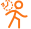
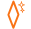
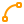
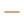
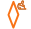
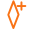

# 🚀 AniKin — Complete Feature Documentation

> **AniKin** is a free, open-source Maya animation toolkit with 30+ tools for character animators. This page covers every module, feature, and workflow in detail.

---

## Table of Contents

- [Pose & Transform Tools](#-pose--transform-tools)
- [AniPose Pro — Visual Pose Library](#-anipose-pro--visual-pose-library)
- [Tweening & Easing](#-tweening--easing)
- [Tangents & Curves](#-tangents--curves)
- [Playback & Key Operations](#-playback--key-operations)
- [Channel Utilities](#-channel-utilities)
- [Advanced Workflow Modules](#-advanced-workflow-modules)
- [Visualization Tools](#-visualization-tools)
- [Pipeline & Diagnostics](#-pipeline--diagnostics)
- [Hotkey Support](#%EF%B8%8F-hotkey-support)

---

## 🎭 Pose & Transform Tools

Your bread and butter tools for manipulating objects and keys.

| Tool | Icon | Description |
|:---|:---:|:---|
| **Reset Pose** |  | Instantly zero out translation and rotation (leaving scale at 1.0). |
| **Mirror & Flip Pose** |  | Negate TX, TZ, and RY to mirror a pose, or swap Left↔Right controls automatically. Right-click for options. |
| **Copy / Paste Pose** |  | Store your current pose in memory and paste it elsewhere. **Pro Tip:** Shift+Click on the timeline to highlight a range, then Copy to capture an entire animated block! |

---

## 📸 AniPose Pro — Visual Pose Library

AniPose Pro is a full-featured **visual pose and animation library** built natively into AniKin. It replaces Maya's limited clipboard with a searchable, taggable, thumbnail-driven library that supports poses, multi-frame animation clips, MEL/Python scripts, and selection sets.

### Key Capabilities

| Feature | Description |
|:---|:---|
| **Pose Capture** | Save any rig pose with a viewport screenshot thumbnail. |
| **Animation Clip Capture** | Save multi-frame animation clips with full Graph Editor curve fidelity (tangent types, angles, weights, locks, infinity, breakdowns). |
| **GIF Thumbnails** | Clips automatically generate animated GIF previews that auto-play in the library grid. |
| **Studio Library Import** | Natively reads Studio Library `.pose` and `.anim` folders — extracts thumbnails, metadata, and JSON controls automatically. |
| **100% Curve-Fidelity Paste** | Clips paste with mathematically identical curves by unlocking tangent handles before setting angles/weights, then re-locking. |
| **Folder Organization** | Drag-and-drop folder tree with color-coded borders, rename, and move support. |
| **Search & Filter** | Full-text search with recency, favorites-only, and minimum-rating filters. |
| **Curve Preview** | Collapsed sparkline or expanded multi-curve graph with grid, axis labels, and per-curve color legend. |
| **Blend Slider** | MMB-drag to blend between current rig state and any library pose (0–100%). |
| **Mirror Apply** | Apply a pose to the opposite side of the rig using AniMirror's name convention. |
| **Additive Apply** | Layer delta values on top of the current rig state. |
| **History Stack** | Every apply operation pushes a pre-apply snapshot — revert any accidental change. |

### UI Design (V3.3)

- **Tab Bar Navigation** — Clean underline-based tabs for All / Poses / Clips / Scripts / Sets.
- **Magnetic Size Slider** — 5-stop slider (XS → XL) that snaps to breakpoints.
- **Grid / List Toggle** — Single button flips between `田` Grid and `≡` List layouts.
- **Dark-Chrome Tokens** — Surface `#383838`, accent-motion `#2FD3C2`, accent-clip `#C9A227`, neutral text `#E8E8E8`.

---

## 🎨 Tweening & Easing

Our custom slider engine gives you absolute control over breakdowns — no Graph Editor needed.

| Tool | Description |
|:---|:---|
| **Tween Slider (TW)** | Linearly blends your current pose between previous and next keyframes. Push past 100% or below 0% for instant overshoots! |
| **Ease Slider (EA)** | Uses a smooth ease-in/ease-out curve. Perfect for organic breakdowns. |
| **Smart Key** |  Sets a keyframe *only* on channels that already have animation, keeping your curves clean. |

---

## 📐 Tangents & Curves

| Tool | Icon | Description |
|:---|:---:|:---|
| **Spline / Linear / Flat / Stepped / Auto** |      | 1-click tangent presets for selected keys or curves. |
| **Euler Filter** |  | Fix gimbal lock on selected curves. |
| **Smooth Curves** |  | Average out jittery keyframes. |
| **Clean Curves** |  | Intelligently reduce keyframe density on dense mocap data while preserving curve shape. |

---

## ▶️ Playback & Key Operations

The redesigned playback cluster puts your most-used keys front and center.

| Tool | Icon | Description |
|:---|:---:|:---|
| **Key Navigation** |     | Jump between keyframes with single clicks. |
| **Set Key** |  | Amber-accented primary action button. |
| **Play / Pause** |  | Visually swaps icons between Play and Pause states. |
| **Delete Key** |  | Removes keyframes with red-on-hover safety feedback. |

---

## 🔒 Channel Utilities

| Tool | Icon | Description |
|:---|:---:|:---|
| **Lock / Unlock Toggle** |  | A single button that swaps between Lock and Unlock states. |

---

## 🔧 Advanced Workflow Modules

| Tool | Icon | Description |
|:---|:---:|:---|
| **AniOffset** |  | Stagger animation across multiple objects by N frames — create overlap in one click. |
| **Nudge Keys** |  | Shift selected keys ±1 frame. Works on Graph Editor selections and timeline ranges. |
| **Duplicate & Slide** |  | Duplicate an entire animation block to a new location. |
| **AniBake (Smart Bake)** |  | Bake world-space motion to a locator, modify the rig, and paste it back. |
| **AniWave** |  | Procedural overlap and follow-through down a chain of controls. |
| **AniNoise** |  | Add organic micro-jitter for living holds and ambient motion. |
| **AniMatch** | — | IK/FK matching and space switching utilities. |
| **AniRetime** | — | Non-destructive animation retiming via editable curve. |
| **AniBlast** | — | Quick viewport playblast with burn-in annotations. |
| **Cam-Lock** |  | Lock the viewport camera to any selected object during playback. Choose Track or Aim mode. |

---

## 🟣 Visualization Tools

| Tool | Icon | Description |
|:---|:---:|:---|
| **Motion Trails** |  | Toggle editable 3D motion trails in viewport. |
| **Ghosting (Onion Skin)** |  | Toggle viewport ghosting for previous/next frames. |

---

## 🔴 Pipeline & Diagnostics

| Tool | Icon | Description |
|:---|:---:|:---|
| **AniCheck** |  | Scans for messy data: decimal frame keys, flat animation, dense mocap keys, foot sliding. Offers 1-click fixes. |
| **AniColor** |  | Keyframe coloring and labeling system for organizing your timeline. |
| **AniExport** |  | Validates your skeleton hierarchy and exports clean FBX for Unreal Engine. |

---

## ⌨️ Hotkey Support

AniKin features a built-in **Hotkey Manager** (). You can bind *any* AniKin tool to a Maya hotkey without writing a single line of Python.

**Highly Recommended:** Map `Copy Pose` to `Ctrl+C` and `Paste Pose` to `Ctrl+V` inside the AniKin Hotkey Manager to override Maya's default geometry duplication behavior!

---

  
⭐ <b>Star AniKin</b> to support the project and get notified about new releases!

