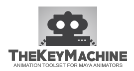
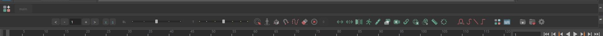
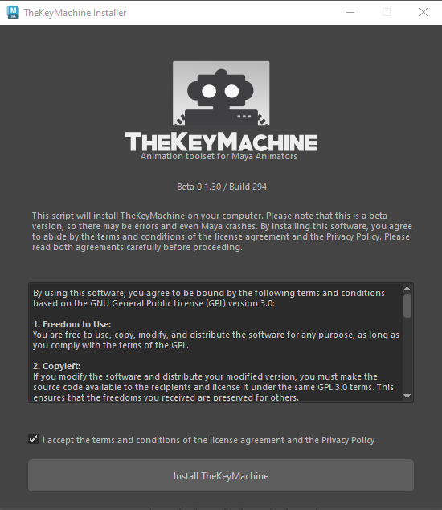

## ⚠️ Project Status: No Longer in Active Development

Thank you to everyone who has used, supported, and donated to **The Key Machine** over the years. 

Unfortunately, due to the lack of financial support needed to sustain server costs and development time, this project is no longer in active development. Furthermore, the official website and domain (`thekeymachine.xyz`) will be permanently shut down around **mid-September 2026**.

**What does this mean for the tools?**
* There will be no further updates, bug fixes, or new features added by the original developer.
* The source code will remain freely available here on GitHub under the **GPL-3.0 License**.
* You are completely free to fork this repository, modify the code, and keep the project alive or adapt it to your own studio's pipeline.

A huge thank you to the animation community for using the toolset, and a special shout-out to the few who contributed with donations. Your support meant a lot!

Happy animating! 🎬

   

# TheKeyMachine - Animation tool for Maya Animators

TheKeyMachine (TKM) is a open source toolset specially designed for 3D animators working with Autodesk Maya.

TheKeyMachine offers advanced animation tools that significantly speed up daily tasks and workflows for animators.

It currently works with Maya versions 2022, 2023, 2024 and 2025 on Windows, Linux, and macOS.

Some of the available features include:

-Simple and fast installer
-Advanced tools like Isolate, Snap, Reset, Counter, Temp Pivot, FollowCam, Anim Offset, Copy and Paste Animation, Copy and Paste World Position, advanced curve editor, customizable menus, and more
-Selection Manager (Selection Sets)
-Advanced sliders for Tween and Blend
And many others

TKM is in the beta phase and is being developed by <b>Rodrigo Torres</b> (<a href="https://www.rodritorres.com">rodritorres.com</a>).  

<a href="https://www.thekeymachine.xyz">TheKeyMachine.xyz</a>

